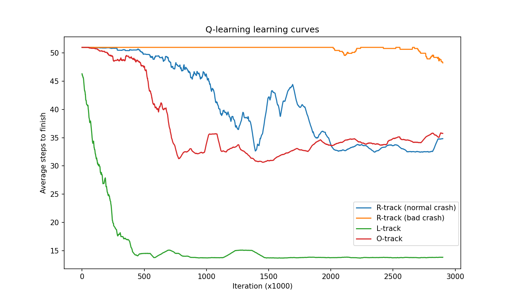
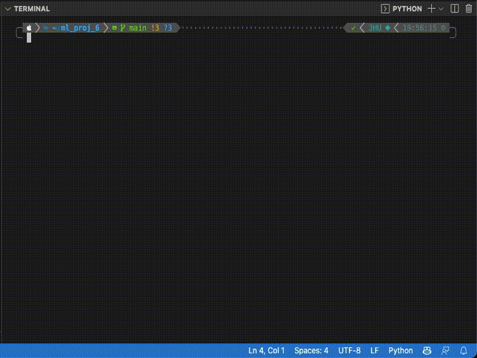

# Introduction to Machine Learning Project 6

Reinforcement learning: Value Iteration, SARSA, and Q-learning on the racetrack problem


## Train a policy

To train a Q-learning policy:

```bash
python exp_Q.py
```

To train a SARSA policy:

```bash
python exp_SARSA.py
```

To train a value iteration policy:

```bash
python exp_VI.py
```

This results in an `arrays` directory which contains the policy at various points during training as well as a 

## Race with a policy

Once a policy is trained, it can be used in a race. 

```bash
python race.py
```

This produces a race like so:


## Results

Plot of learning curves for Q-Learning on different tracks and with different crash behavior. A "normal crash" means that if the car crashes into a wall, it returns to the last valid track square, whereas a "bad crash" means that it returns to the starting line upon crashing. 



Example race:




